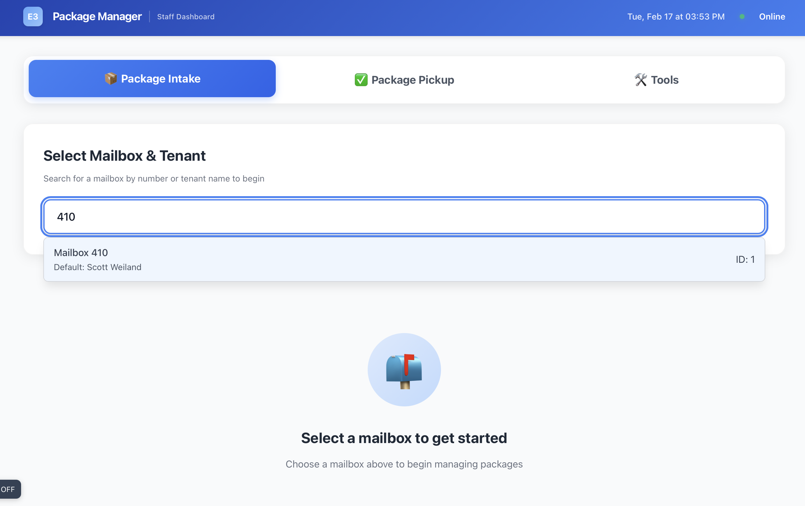
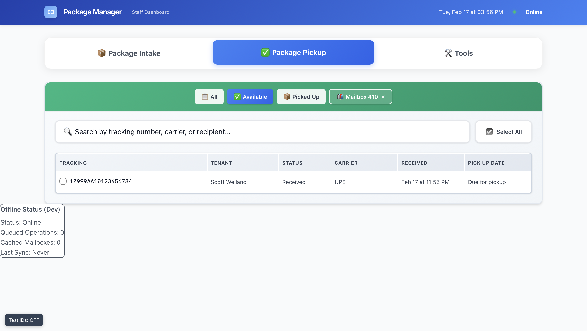
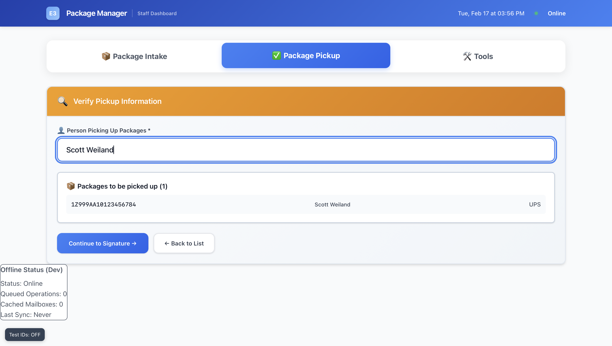
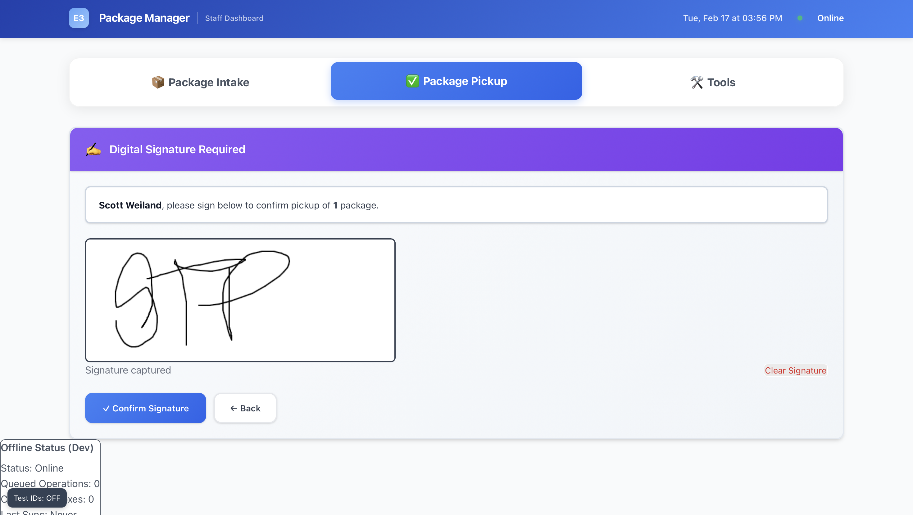
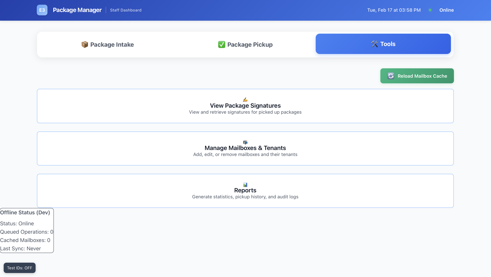

# E3 Package Manager

A comprehensive package inventory management system for mailbox renting centers. Built with a staff-first approach for speed, reliability, and keyboard-optimized workflows.

> **Open Source Project**: This application is now open source and ready for community contribution. The repository contains a clean database schema template - you'll need to set up your own database instance following the setup instructions below.

## 🏗️ Architecture

- **Frontend**: React + TypeScript + Vite + custom CSS
- **Backend**: Node.js + Express + PostgreSQL
- **Features**: PWA, Offline support, Real-time scanning, Signature capture

## 🖼️ UI Screenshots

Add your UI screenshots to `docs/screenshots/` and they will render here on GitHub.

<p>
	
</p>

<p>
	
</p>

<p>
	
</p>

<p>
	
</p>

<p>
	
</p>

## 🚀 Quick Start

### Prerequisites

- Node.js 18+ 
- PostgreSQL 15+
- npm or yarn

### 1. Setup Database

```bash
# Create database
createdb e3_package_manager

# Run schema setup
psql e3_package_manager < backend/database_schema.sql
```

### 2. Backend Setup

```bash
cd backend
npm install

# Configure environment
cp .env.example .env
# Edit .env with your database credentials

# Start development server
npm run dev
```

### 3. Frontend Setup

```bash
cd frontend
npm install

# Start development server
npm run dev
```

### 4. Access Application

- **Frontend**: http://localhost:5173
- **Backend API**: http://localhost:3001
- **API Health**: http://localhost:3001/health

## 📋 Key Features

### 🔍 Instant Tenant Lookup
- Type mailbox number → instant name resolution
- Auto-complete with search-as-you-type
- Performance target: <100ms lookup time
- Preloaded tenant cache for offline operation

### 📥 Package Intake
- Barcode scanning via camera or handheld scanner
- Keyboard-first navigation (Tab, Enter workflow)
- Automatic tenant validation
- Real-time duplicate detection
- Performance target: <200ms scan-to-save
 - Simplified intake: only tracking_number and tenant_id are required; server infers mailbox_id

### 📤 Package Pickup
- Tenant package list with status filtering
- Signature capture for high-value packages
- Bulk pickup processing
- Audit trail for all transactions
- Performance target: <500ms including signature

### 🔒 Security & Compliance
- Input validation and sanitization
- Rate limiting and DDoS protection
- Audit logging for all operations
- Signature storage with integrity checks

## 🎯 Performance Targets

- **Tenant Lookup**: <100ms cached, <300ms DB query
- **Package Intake**: <200ms scan-to-save latency  
- **Pickup Validation**: <300ms for 1,000 items
- **Signature Capture**: <500ms upload and save
- **Offline Queue**: Reliable sync when online

## 📱 Progressive Web App

The application works as a PWA with:
- Offline package intake (queued sync)
- Home screen installation
- Background sync capabilities
- Service worker caching

## 🗄️ Database Schema

### Core Tables
- **tenants**: Mailbox holders with contact info
- **packages**: Package inventory with tracking
- **pickup_events**: Audit trail for all pickups
- **signatures**: Captured signatures for high-value items

### Performance Indexes
- `idx_tenants_mailbox_number` - Instant tenant lookup
- `idx_packages_tracking_number` - Package search
- `idx_packages_tenant_status` - Pickup queries
- `idx_pickup_events_timestamp` - Audit queries

## 🛠️ Development

### Project Structure

```
E3 Package Manager/
├── backend/
│   ├── src/
│   │   ├── routes/          # API endpoints
│   │   ├── models/          # Database layer
│   │   ├── middleware/      # Express middleware
│   │   └── index.js         # Server entry point
│   ├── database_schema.sql  # PostgreSQL schema
│   └── package.json
├── frontend/
│   ├── src/
│   │   ├── components/      # React components
│   │   ├── services/        # API client
│   │   ├── types/           # TypeScript definitions
│   │   └── App.tsx          # Main application
│   └── package.json
└── README.md
```

### API Endpoints

#### Tenants
- `GET /api/tenants` - List all active tenants
- `GET /api/tenants/search?q={query}` - Search tenants
- `GET /api/tenants/mailbox/{number}` - Get by mailbox
- `POST /api/tenants` - Create new tenant
- `PUT /api/tenants/{id}` - Update tenant
- `DELETE /api/tenants/{id}` - Deactivate tenant

#### Packages  
- `GET /api/packages` - List packages with filters
- `GET /api/packages/tenant/{id}` - Tenant's packages
- `GET /api/packages/tracking/{number}` - Find by tracking
- `POST /api/packages` - Register new package
- `PUT /api/packages/{id}/status` - Update status
- `PUT /api/packages/{id}` - Update details

#### Pickups
- `GET /api/pickups` - Pickup history (audit trail)
- `POST /api/pickups` - Process pickup with signature
- `GET /api/pickups/{id}` - Pickup event details
- `POST /api/pickups/bulk-status` - Bulk status update

#### Signatures
- `GET /api/signatures/{id}` - Signature metadata
- `GET /api/signatures/image/{id}` - Signature image
- `GET /api/signatures/pickup-event/{id}` - By pickup event
- `DELETE /api/signatures/{id}` - Remove signature

## 🔧 Configuration

### Backend (.env)
```bash
# Database
DB_HOST=localhost
DB_PORT=5432  
DB_NAME=e3_package_manager
DB_USER=postgres
DB_PASSWORD=password

# Server
PORT=3001
NODE_ENV=development
FRONTEND_URL=http://localhost:5173
```

### Frontend (.env)
```bash
VITE_API_URL=http://localhost:3001/api
```

## 📊 Monitoring & Observability

### Logging
- Structured JSON logs for all API requests
- Performance monitoring with timing metrics  
- Slow query detection (>100ms threshold)
- Error tracking with stack traces

### Health Checks
- `GET /health` - Application health status
- Database connectivity verification
- Performance metrics reporting

## 🚀 Deployment

### Production Build

```bash
# Backend
cd backend
npm run build
npm start

# Frontend  
cd frontend
npm run build
npm run preview
```

### Environment Setup

1. **Database**: Configure PostgreSQL with connection pooling
2. **File Storage**: Set up cloud storage for signatures (AWS S3/Supabase)
3. **SSL**: Configure HTTPS for production
4. **Monitoring**: Set up logging and error tracking
5. **Backup**: Implement automated database backups

### Scalability Considerations

- Database read replicas for high traffic
- CDN for static assets and signatures
- Horizontal scaling with load balancers
- Redis cache for tenant data
- Queue systems for background processing

## 🧪 Testing

```bash
# Backend tests
cd backend  
npm test

# Frontend tests
cd frontend
npm test

# Integration tests
npm run test:integration

# Performance tests  
npm run test:performance
```

## 📝 API Documentation

Full API documentation available at `/api/docs` when running in development mode.

Interactive API testing available via:
- Postman collection: `docs/postman_collection.json`
- OpenAPI spec: `docs/openapi.yaml`

## 🤝 Contributing

1. Fork the repository
2. Create feature branch (`git checkout -b feature/amazing-feature`)
3. Commit changes (`git commit -m 'Add amazing feature'`)
4. Push to branch (`git push origin feature/amazing-feature`)
5. Open Pull Request

## 📄 License

This project is proprietary software for E3 Package Management Solutions.

## 🆘 Support

For technical support and questions:
- Email: support@e3packagemanager.com  
- Documentation: https://docs.e3packagemanager.com
- Issue Tracker: GitHub Issues

---

**Built with ❤️ for efficient package management**