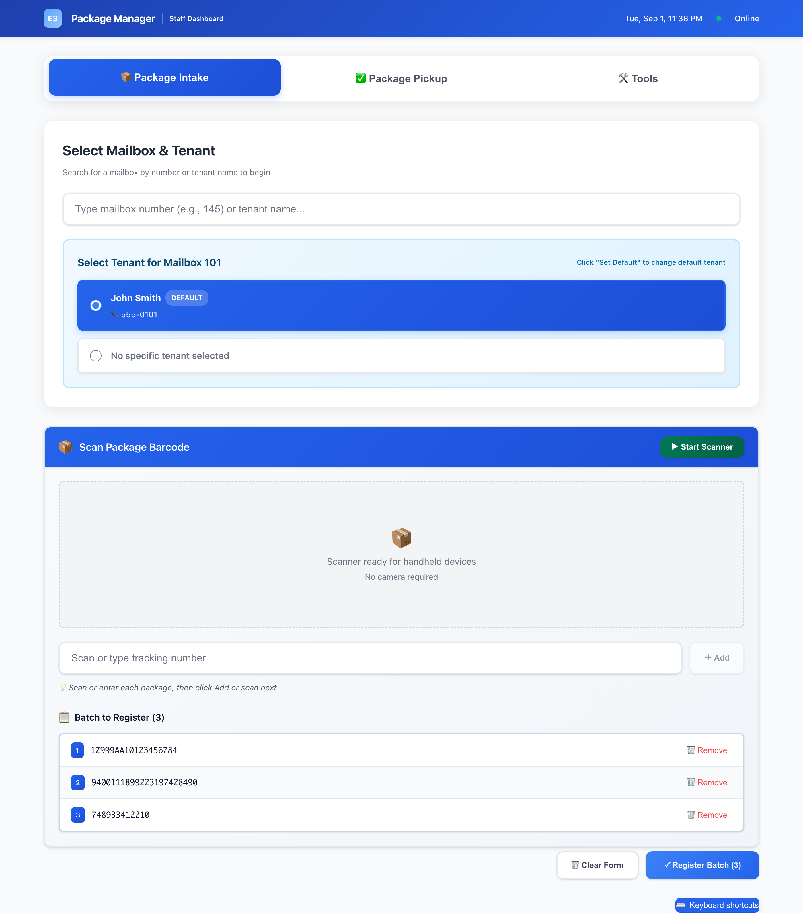
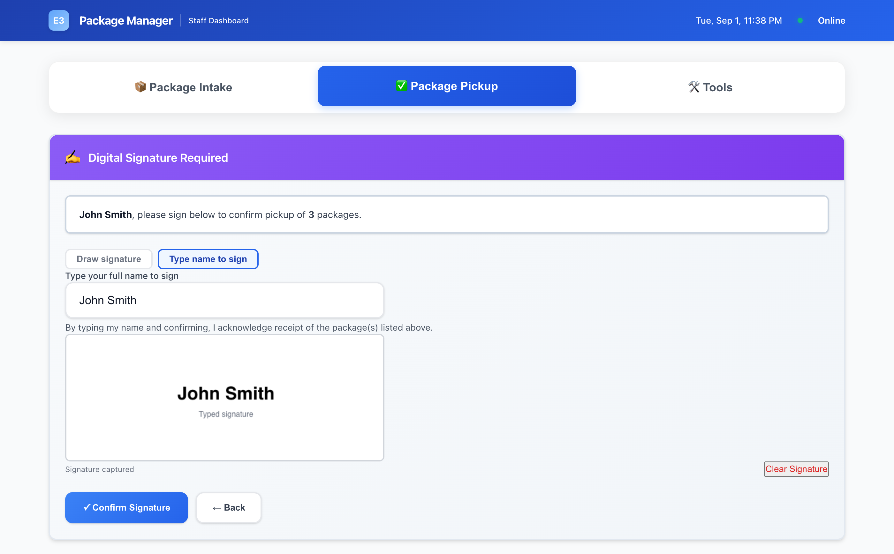
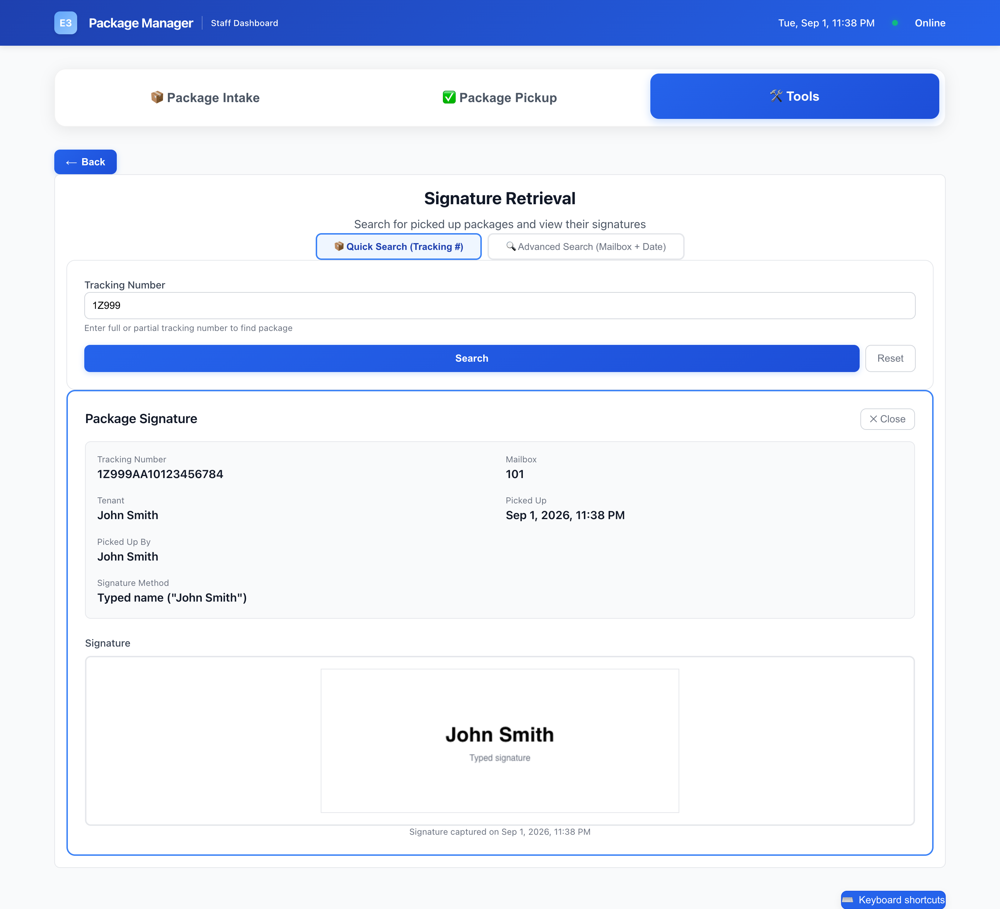
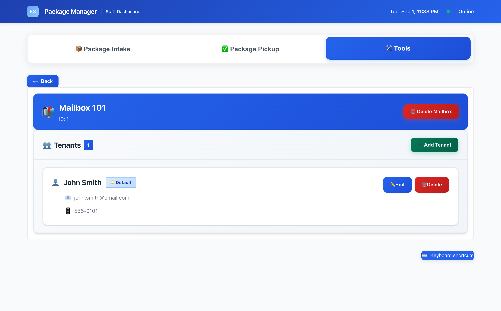

# E3 Package Manager

A package inventory management system for mailbox renting centers. Built with a staff-first approach for speed, reliability, and keyboard-optimized workflows.

> **Open Source Project**: Free and open source under the MIT license. No database setup required — the app creates a local SQLite database and seeds demo data on first run.

## ⬇️ Download & Install

Grab the installer for your computer from the **[latest release](https://github.com/generaljudas/E3-Package-Management/releases/latest)**:

| Platform | File | Notes |
|---|---|---|
| Windows 10/11 | `E3-Package-Manager-Setup-<version>.exe` | Recommended. Double-click, follow the installer. |
| macOS (Apple Silicon) | `E3-Package-Manager-<version>-arm64.dmg` | Drag to Applications. |
| Linux | `E3-Package-Manager-<version>.AppImage` | `chmod +x`, then run. |

The installers are **not code-signed yet**, so Windows and macOS will show a
warning the first time. It takes two clicks to get past —
**[docs/INSTALL.md](docs/INSTALL.md)** shows exactly what you'll see and what
to click. Everything else is automatic: no database to set up, no server to
run, no account to create.

## 🖼️ Screenshots

**Find the mailbox** — type a number or a name; Enter selects the exact match so a scanner-and-keyboard workflow never touches the mouse.

<p></p>

**Package intake** — the tenant is pre-selected, the scanner box is armed, and each scanned tracking number lands in the batch. One click registers them all.

<p></p>

**Package pickup** — filter by status or by mailbox, search, select all, proceed.

<p></p>

**Sign for the pickup** — draw on a touchscreen or with a mouse…

<p></p>

…or type a name, which is an equally valid signature and fully keyboard-accessible (see [docs/SIGNATURE_POLICY.md](docs/SIGNATURE_POLICY.md)).

<p></p>

**Look a signature up later** — by tracking number, or by mailbox and date range. The record shows who picked up, when, and how it was signed.

<p></p>

**Tools** — signatures, mailbox and tenant management, reports.

<p></p>

<p></p>

## 🏗️ Architecture

- **Frontend**: React + TypeScript + Vite
- **Backend**: Node.js + Express + SQLite (created automatically on first run)
- **Desktop**: Electron shell — the backend runs on Electron's bundled Node, the database lives in your OS user-data folder

## 🚀 Quick Start (from source)

If you just want to use the app, see [Download & Install](#%EF%B8%8F-download--install) above. The steps below are for running from source.

### Prerequisites

- Node.js 20.19 or newer (Node 22 LTS recommended)
- npm

### 1. Backend

```bash
cd backend
npm install
npm run dev
```

The SQLite database is created and seeded with demo data automatically. No configuration needed — see [Configuration](#-configuration) to customize.

### 2. Frontend

```bash
cd frontend
npm install
npm run dev
```

### 3. Access Application

- **Frontend**: http://localhost:5173
- **Backend API**: http://localhost:3001
- **API Health**: http://localhost:3001/api/health

### 4. Desktop shell and installers (optional)

```bash
npm install
npm run electron:dev      # opens the Electron window against the two dev servers
npm run electron:build    # builds an installer for the current OS into dist-electron/
```

## 📋 Key Features

### 🔍 Instant Tenant Lookup
- Type mailbox number → instant name resolution
- Auto-complete with search-as-you-type
- Preloaded mailbox cache for offline operation

### 📥 Package Intake
- Barcode scanning via handheld USB scanner (keyboard-emulation mode — no camera required)
- Keyboard-first navigation (Tab, Enter workflow)
- Automatic tenant validation and duplicate detection
- Simplified intake: only tracking number and tenant are required; the server infers the mailbox

### 📤 Package Pickup
- Package list with status filtering and search
- Signature on pickup — draw it, or type your name (a typed name is a valid signature; see [docs/SIGNATURE_POLICY.md](docs/SIGNATURE_POLICY.md))
- Bulk pickup processing
- Audit trail for all pickup events

### ♿ Accessibility
- WCAG 2.2 AA: every control has a name and role, status changes are announced to screen readers, focus is managed through multi-step flows, and every screen is operable without a mouse — see [docs/A11Y_AUDIT.md](docs/A11Y_AUDIT.md)

### 🛠️ Tools
- Manage mailboxes and their tenants
- View and retrieve captured signatures
- Reports: statistics, pickup history, and audit logs

### 📡 Offline Support
- Mailbox data is cached locally for lookups without a connection
- Package operations made while offline are queued and synced when the connection returns

### 🔒 Security
- Input validation and sanitization (express-validator)
- Rate limiting (express-rate-limit) and hardened HTTP headers (helmet)
- Pickup audit trail with signature storage

## 🗄️ Database

SQLite, stored at `backend/database.sqlite` by default (configurable via `DB_PATH`).

### Core Tables
- **mailboxes**: Physical mailboxes at the center
- **tenants**: Mailbox holders with contact info
- **packages**: Package inventory with tracking numbers and status
- **pickup_events**: Audit trail for all pickups
- **signatures**: Captured signatures linked to pickup events

## 🛠️ Development

### Project Structure

```
E3 Package Manager/
├── backend/
│   ├── src/
│   │   ├── routes/          # API endpoints
│   │   ├── models/          # Database layer
│   │   └── index.js         # Server entry point
│   ├── scripts/             # Customer data migration tooling
│   └── package.json
├── frontend/
│   ├── src/
│   │   ├── components/      # React components
│   │   ├── hooks/           # Focus, offline, toast, cache hooks
│   │   ├── services/        # API client, offline queue
│   │   ├── types/           # TypeScript definitions
│   │   └── App.tsx          # Main application
│   └── package.json
├── electron/                # Desktop shell
├── docs/                    # Documentation and screenshots
└── README.md
```

### API Routes

| Base path | Purpose |
|---|---|
| `/api/mailboxes` | Mailbox CRUD and tenant assignment |
| `/api/tenants` | Tenant CRUD and search |
| `/api/packages` | Package intake, search, and status updates |
| `/api/pickups` | Pickup processing and history |
| `/api/signatures` | Signature retrieval and management |
| `/api/reports` | Statistics, pickup history, audit logs |
| `/api/health` | Health check |

See [docs/DOCUMENTATION.md](docs/DOCUMENTATION.md) for the full reference (schema, API, data flow, `data-testid` catalog).

## 🔧 Configuration

All configuration is optional — the defaults work out of the box. To customize, copy `backend/.env.example` to `backend/.env`:

```bash
PORT=3001                    # API port
NODE_ENV=development
FRONTEND_URL=http://localhost:5173   # CORS origin for the frontend
DB_PATH=./database.sqlite    # SQLite file location
SKIP_SEED=false              # Set to true to start with an empty database
```

Frontend (`frontend/.env`, optional):

```bash
VITE_API_URL=http://localhost:3001/api
```

## 🗺️ Roadmap

The mission, what's done, and what's next live in **[docs/ROADMAP.md](docs/ROADMAP.md)**. Deliberately later:

- **Signed builds** — code signing and notarization so installers run without security warnings
- **Auto-update** — in-app updates for installed desktop builds
- **Automated test suite**
- **Multi-station support** — multiple front-desk computers sharing one database (PostgreSQL)
- **Visual redesign** — a separate chapter, after the above

Release history: [CHANGELOG.md](CHANGELOG.md).

## 🤝 Contributing

Bug reports, Windows smoke tests, doc fixes, and code are all welcome — start
with **[CONTRIBUTING.md](CONTRIBUTING.md)** for setup, standards (keyboard-first,
WCAG 2.2 AA, no real customer data), and the PR process.

## 📄 License

MIT — see [LICENSE](LICENSE).

## 🆘 Support

- Email: javieribarra.dev@gmail.com
- Issue Tracker: [GitHub Issues](https://github.com/generaljudas/E3-Package-Management/issues)

---

**Built with ❤️ for efficient package management**
