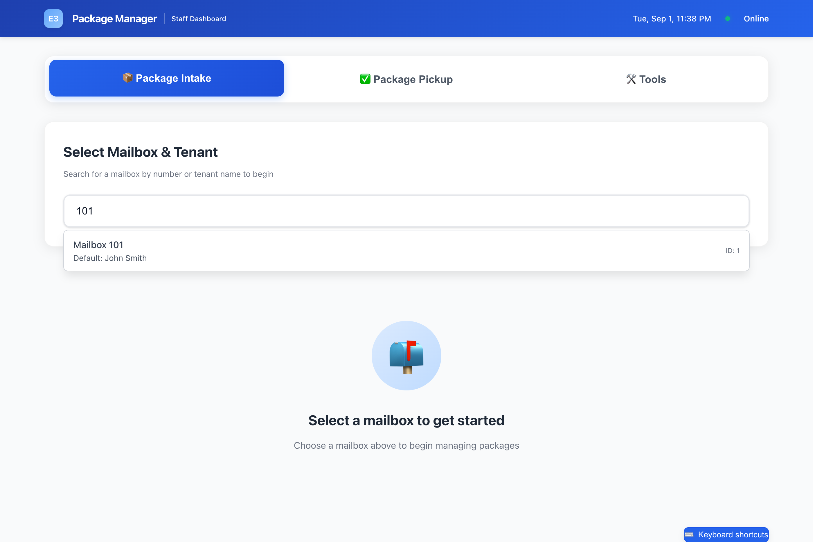
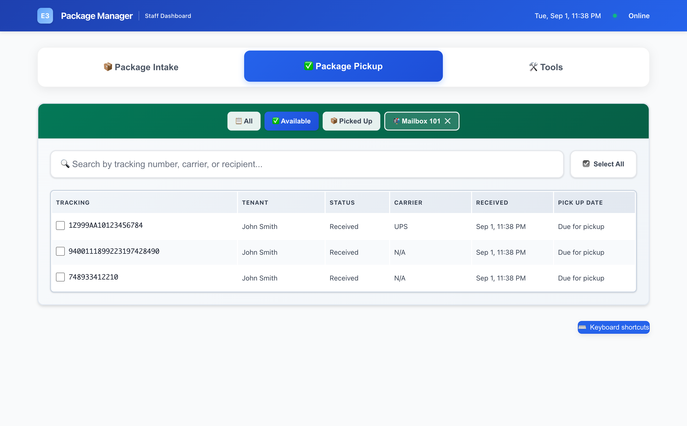
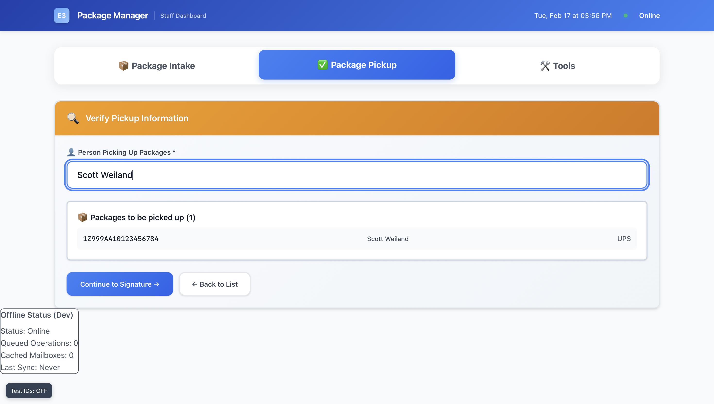
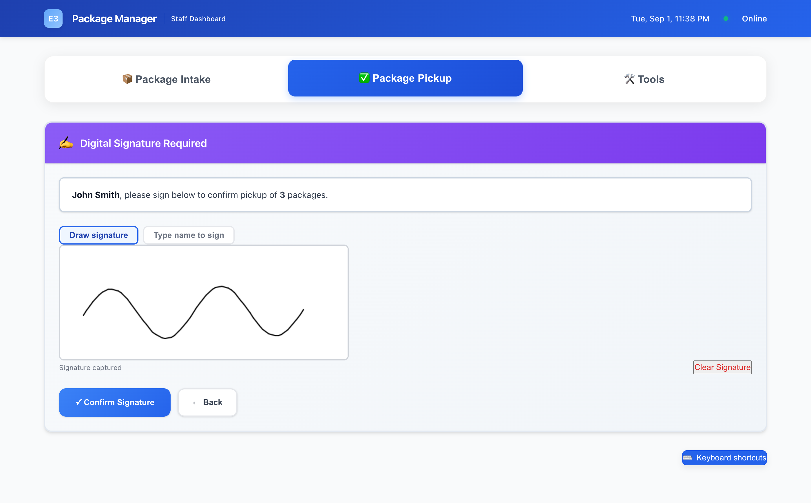
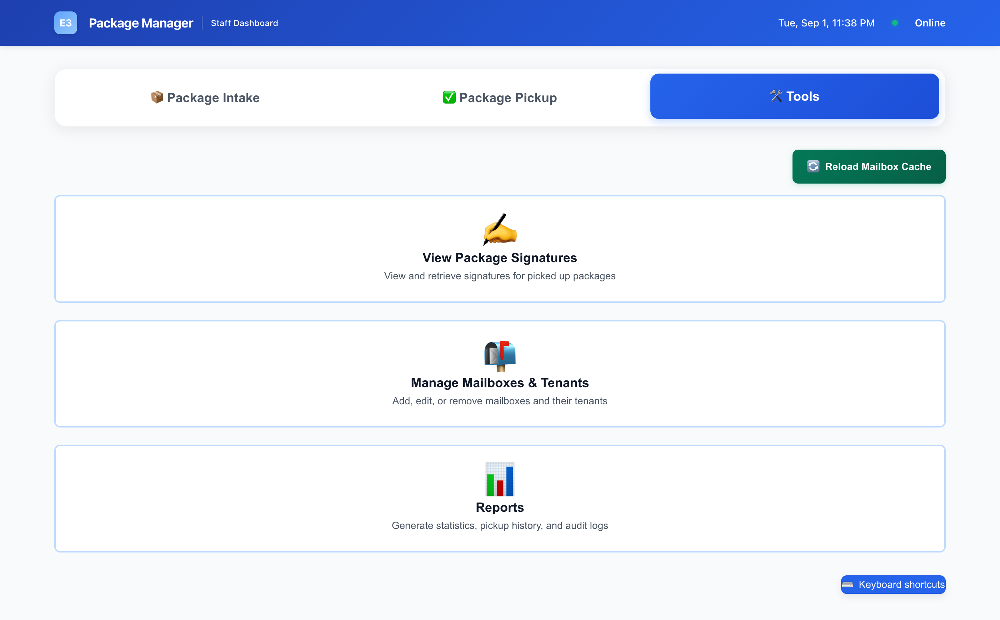

# E3 Package Manager

A package inventory management system for mailbox renting centers. Built with a staff-first approach for speed, reliability, and keyboard-optimized workflows.

> **Open Source Project**: Free and open source under the MIT license. No database setup required — the app creates a local SQLite database and seeds demo data on first run.

## 🖼️ UI Screenshots


<p>
	
</p>

<p>
	
</p>

<p>
	
</p>

<p>
	
</p>

<p>
	
</p>

## 🏗️ Architecture

- **Frontend**: React + TypeScript + Vite
- **Backend**: Node.js + Express + SQLite (created automatically on first run)
- **Desktop**: Electron shell (packaged installers in progress — see Roadmap)

## 🚀 Quick Start

### Prerequisites

- Node.js 18+
- npm

### 1. Backend

```bash
cd backend
npm install
npm run dev
```

The SQLite database is created and seeded with demo data automatically. No configuration needed — see [Configuration](#-configuration) to customize.

### 2. Frontend

```bash
cd frontend
npm install
npm run dev
```

### 3. Access Application

- **Frontend**: http://localhost:5173
- **Backend API**: http://localhost:3001
- **API Health**: http://localhost:3001/api/health

## 📋 Key Features

### 🔍 Instant Tenant Lookup
- Type mailbox number → instant name resolution
- Auto-complete with search-as-you-type
- Preloaded mailbox cache for offline operation

### 📥 Package Intake
- Barcode scanning via handheld USB scanner (keyboard-emulation mode — no camera required)
- Keyboard-first navigation (Tab, Enter workflow)
- Automatic tenant validation and duplicate detection
- Simplified intake: only tracking number and tenant are required; the server infers the mailbox

### 📤 Package Pickup
- Package list with status filtering and search
- Digital signature capture on pickup
- Bulk pickup processing
- Audit trail for all pickup events

### 🛠️ Tools
- Manage mailboxes and their tenants
- View and retrieve captured signatures
- Reports: statistics, pickup history, and audit logs

### 📡 Offline Support
- Mailbox data is cached locally for lookups without a connection
- Package operations made while offline are queued and synced when the connection returns

### 🔒 Security
- Input validation and sanitization (express-validator)
- Rate limiting (express-rate-limit) and hardened HTTP headers (helmet)
- Pickup audit trail with signature storage

## 🗄️ Database

SQLite, stored at `backend/database.sqlite` by default (configurable via `DB_PATH`).

### Core Tables
- **mailboxes**: Physical mailboxes at the center
- **tenants**: Mailbox holders with contact info
- **packages**: Package inventory with tracking numbers and status
- **pickup_events**: Audit trail for all pickups
- **signatures**: Captured signatures linked to pickup events

## 🛠️ Development

### Project Structure

```
E3 Package Manager/
├── backend/
│   ├── src/
│   │   ├── routes/          # API endpoints
│   │   ├── models/          # Database layer
│   │   └── index.js         # Server entry point
│   ├── scripts/             # Customer data migration tooling
│   └── package.json
├── frontend/
│   ├── src/
│   │   ├── components/      # React components
│   │   ├── hooks/           # Focus, offline, toast, cache hooks
│   │   ├── services/        # API client, offline queue
│   │   ├── types/           # TypeScript definitions
│   │   └── App.tsx          # Main application
│   └── package.json
├── electron/                # Desktop shell
├── docs/                    # Documentation and screenshots
└── README.md
```

### API Routes

| Base path | Purpose |
|---|---|
| `/api/mailboxes` | Mailbox CRUD and tenant assignment |
| `/api/tenants` | Tenant CRUD and search |
| `/api/packages` | Package intake, search, and status updates |
| `/api/pickups` | Pickup processing and history |
| `/api/signatures` | Signature retrieval and management |
| `/api/reports` | Statistics, pickup history, audit logs |
| `/api/health` | Health check |

See [DOCUMENTATION.md](DOCUMENTATION.md) for details.

## 🔧 Configuration

All configuration is optional — the defaults work out of the box. To customize, copy `backend/.env.example` to `backend/.env`:

```bash
PORT=3001                    # API port
NODE_ENV=development
FRONTEND_URL=http://localhost:5173   # CORS origin for the frontend
DB_PATH=./database.sqlite    # SQLite file location
SKIP_SEED=false              # Set to true to start with an empty database
```

Frontend (`frontend/.env`, optional):

```bash
VITE_API_URL=http://localhost:3001/api
```

## 🗺️ Roadmap

- **Desktop installers** — one-click download-and-run app for Windows, macOS, and Linux (Windows first)
- **Signed builds** — code signing and notarization so installers run without security warnings
- **Automated test suite**
- **Accessibility** — WCAG 2.2 AA conformance
- **Auto-update** — in-app updates for installed desktop builds
- **Multi-station support** — multiple front-desk computers sharing one database (PostgreSQL)
- **OpenAPI documentation**
- **PWA installation** — home-screen install with full service-worker support

## 🤝 Contributing

1. Fork the repository
2. Create feature branch (`git checkout -b feature/amazing-feature`)
3. Commit changes (`git commit -m 'Add amazing feature'`)
4. Push to branch (`git push origin feature/amazing-feature`)
5. Open Pull Request

## 📄 License

MIT — see [LICENSE](LICENSE).

## 🆘 Support

- Email: javieribarra.dev@gmail.com
- Issue Tracker: [GitHub Issues](https://github.com/generaljudas/E3-Package-Management/issues)

---

**Built with ❤️ for efficient package management**
